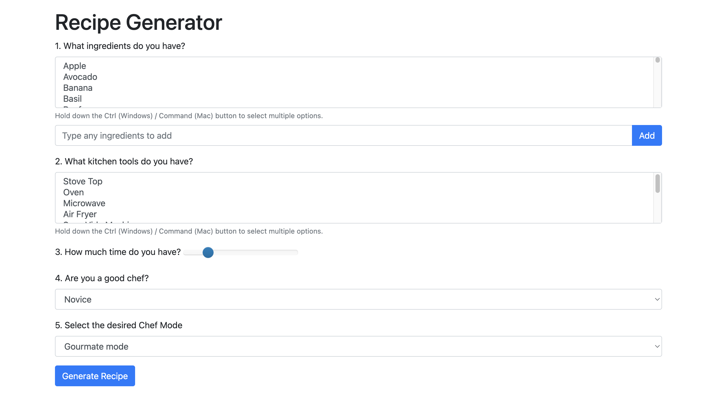

# Recipe Generator Application

The Recipe Generator is a web application that generates recipes based on user inputs. It utilizes the GPT-2 or openapi language model to generate creative and unique recipes tailored to the user's preferences.



## Installation

1. Clone or fork and then clone the repository:
`git clone <repository_url>`
`cd recipe-generator`

2. Run the setup script to install the necessary dependencies and download the GPT-2 model checkpoint:
`./setup.sh`

3. Start the Flask application with python app directly or you can use gunicorn as well:
`python app.py`

If you prefer to use Gunicorn as the web server for your Flask application, you can follow these steps:

* Install Gunicorn by running the following command in your terminal:
   ```
   pip install gunicorn
   ```

* Create a new file called `wsgi.py` in the same directory as your `app.py` file. Add the following code to `wsgi.py`:

```python
from app import app

if __name__ == '__main__':
    app.run()
```

* Run the Flask application using Gunicorn by executing the following command in your terminal:
   ```
   gunicorn wsgi:app
   ```

   Gunicorn will start the Flask application and serve it using multiple worker processes.

Now, your Flask application will be running using Gunicorn as the web server. You can access it by visiting the appropriate URL in your browser.

Please note that the above steps assume that your `app.py` file and the HTML template (`index.html`) are in the same directory. Adjust the paths accordingly if they are in different locations.

Additionally, it's important to ensure that you follow best practices for deploying web applications, such as running Gunicorn behind a production-ready web server like Nginx and configuring appropriate security measures.


4. Access the application by visiting `http://localhost:5000` in your web browser.

## Usage

1. Open the web application in your browser.

2. Fill in the form with the following information:
- Ingredients: Select or type the ingredients you have. You can add multiple ingredients.
- Kitchen Tools: Select the kitchen tools you have. You can select multiple tools.
- Time: Select the desired time range for the recipe.
- Chef Mode: Select your cooking expertise level.
- Chef Mode: Select the desired chef mode.

3. Click the "Generate Recipe" button.

4. The application will use the GPT-2 model to generate a recipe based on your inputs. The generated recipe will be displayed on the screen.

## Contributing

Contributions are welcome! If you encounter any issues or have suggestions for improvements, please open an issue or submit a pull request.

## License

This project is licensed under the [MIT License](LICENSE).


